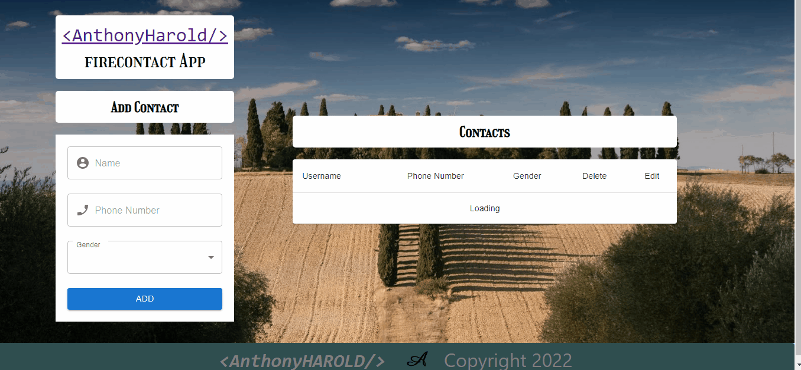

# FireContact App
## Project Skeleton

```
FireContact App
|
|----readme.md         
SOLUTION
├── public
│     └── index.html
├── src
│    ├── utils
│    │     ├── firebase.js
│    │     ├── functions.js
│    │     └──toast.js
│    ├── components
│    │     ├── contacts
│    │     │     └── Contact.js
│    │     └── form
│    │          └── FormComponent.js
│    ├── App.js
│    ├── index.js
│    └── index.css
├── package.json
├── .env

```



## Objective

Build a Movie App using ReactJS.
### !Note:
<p>Keys were used by creating a .env .When you download or clone the repository, you need to enter the .env and type your own passwords in the appropriate places</p>
